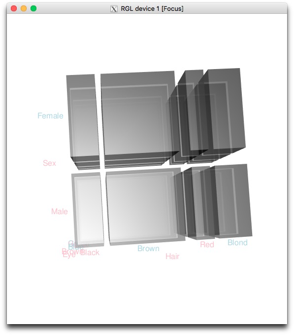

---
output:
  pdf_document: default
  html_document: default
---
# (PART\*) Parte II: Estadística descriptiva {-}


# Descripción de datos cualitativos {#chap:edqual}

Los **datos cualitativos** corresponden a observaciones sobre cualidades de un objeto o individuo, tales como su  especie o su sexo, que pueden ser iguales o diferentes, pero que no admiten ningún otro tipo de comparación significativa: por ejemplo, datos para los que no tenga ningún sentido preguntarse si uno es más grande que otro, ni efectuar operaciones aritméticas con ellos, aunque estén representados por números. Llamaremos **variable cualitativa**  a una lista de observaciones de un tipo de datos cualitativos  sobre un conjunto concreto de objetos, y  **niveles**, como en los factores,  a los diferentes valores que pueden tomar estos datos; por ejemplo, los dos niveles de una variable *Sexo*  serían "Macho" y "Hembra", o sinónimos.

Con R, usaremos vectores y factores para representar variables cualitativas. Los factores nos servirán para agrupar las observaciones según los niveles de la variable. De esta manera podremos segmentar la población que representa la variable en grupos o subpoblaciones, asignando un grupo a cada nivel, y podremos comparar el comportamiento de otras variables sobre estos grupos. 


## Frecuencias {#sec:edqual}

 Los estadísticos básicos para datos cualitativos son sencillos: dada una variable
cualitativa, para cada uno de sus niveles  podemos contar cuántos datos hay en ese nivel (la **frecuencia absoluta** del nivel) y qué fracción del total representan (la **frecuencia relativa**  del nivel) y nada más.


\BeginKnitrBlock{example}
<span class="example" id="exm:ex1601"><strong>(\#exm:ex1601) </strong></span>Supongamos que se ha realizado un seguimiento a 20 personas ingresadas en un geriátrico. Uno de los datos que se han recogido sobre estas personas ha sido su sexo. El resultado ha sido una variable cualitativa formada por las 20 observaciones siguientes:
  

\EndKnitrBlock{example}
 
<p style="text-align:center">Mujer,  Mujer,  Hombre,  Mujer,  Mujer,  Mujer,  Mujer,  Mujer,  Hombre, Mujer
Hombre,  Hombre,  Mujer,  Mujer,  Hombre,  Mujer,  Mujer,  Mujer,  Mujer,  Hombre.</p>

 

Sus dos niveles son *Hombre* y *Mujer*. En esta variable
 hay 14 mujeres y 6 hombres. Por lo tanto, éstas son las frecuencias absolutas de estos niveles. Puesto que en total hay 20 individuos, sus frecuencias relativas son

<p style="text-align:center">*Hombre*: 6/20=0.3, *Mujer*: 14/20=0.7.</p>

En general, supongamos que tenemos un tipo de datos cualitativos con niveles
$$
l_1, l_2, \ldots, l_k.
$$
Efectuamos $n$ observaciones de este tipo de datos, y sean
$$
x_1, x_2, \ldots, x_n
$$

los resultados que obtenemos.
Cada una de estas observaciones $x_j$ toma como valor alguno de los niveles $l_i$. Estas observaciones forman una **variable cualitativa**.

Así, en el ejemplo anterior tendríamos que $l_1$=*Hombre* y  $l_2$=*Mujer*, 
que $n=20$ (el número de observaciones efectuadas), y $x_1, \ldots, x_{20}$ formarían la muestra de sexos.

Con estas notaciones:

* La **frecuencia absoluta** del nivel $l_j$ en esta variable cualitativa, que denotaremos por $n_j$, es el número de observaciones en las que el resultado $x_i$ es igual al nivel $l_j$.

* La **frecuencia relativa** del nivel $l_j$ en esta variable cualitativa  es la fracción $f_j={n_j}/{n}$. Es decir,  la fracción (en tanto por uno) de observaciones que corresponden a este nivel. El tanto por ciento de observaciones del nivel $l_j$ es entonces $f_j\cdot 100\%$.

* La **moda**  de esta variable cualitativa es su nivel, o niveles, de mayor frecuencia (absoluta o relativa, tanto da).

La tabla siguiente resume las frecuencias absolutas y relativas de la variable cualitativa  del Ejemplo \@ref(exm:ex1601), con las notaciones que acabamos de introducir. Su moda es el nivel *Mujer*.

$$
\begin{array}{|c||rrr|}
\hline \mathbf{Sexo} & n_j & f_j & \% \\\hline\hline
\mbox{Hombre} & 6 & 0.3 & 30\% \\
\mbox{Mujer} & 14 & 0.7 & 70 \% \\\hline
Total & 20 & 1 & 100\% \\\hline
\end{array}
$$

## Tablas unidimensionales de frecuencias

Supongamos que tenemos una variable cualitativa guardada en un vector o un factor (para simplificar, en lo que queda de sección, diremos  **vector**  para referirnos genéricamente tanto a un vector como a un factor). Por ejemplo:


```r
x=c(3,2,5,1,3,1,5,6,2,2,2,1,3,5,2)
x
#>  [1] 3 2 5 1 3 1 5 6 2 2 2 1 3 5 2
Respuestas=factor(c("No","No","Sí","No","Sí","No","No","Sí"))
Respuestas
#> [1] No No Sí No Sí No No Sí
#> Levels: No Sí
```


Con R, la **tabla de frecuencias absolutas**  de un vector que representa una variable cualitativa se calcula con la función `table`. En nuestros ejemplos:


```r
table(x)
#> x
#> 1 2 3 5 6 
#> 3 5 3 3 1
table(Respuestas)
#> Respuestas
#> No Sí 
#>  5  3
```


El resultado de una función `table` es un objeto de datos  de un tipo nuevo: una **tabla de contingencia**, una *table* en el argot de R. Como vemos, al aplicar `table` a un vector obtenemos una tabla unidimensional formada por una fila con los niveles  de la variable y una segunda fila donde, debajo de cada nivel, aparece su frecuencia absoluta en el vector. 

Los nombres de las columnas de una tabla unidimensional se obtienen con la función `names`.


```r
names(table(x))
#> [1] "1" "2" "3" "5" "6"
names(table(Respuestas))
#> [1] "No" "Sí"
```


Habréis observado que en la  `table`  de un vector sólo aparecen los nombres de los niveles presentes en el vector.  Si el tipo de datos cualitativos usado tenía más niveles y queremos que aparezcan explícitamente en la tabla (con frecuencia 0), hay que transformar el vector en un factor con los niveles deseados.


```r
z=factor(x, levels=1:7)  #Los niveles serán 1,2,3,4,5,6,7
z
#>  [1] 3 2 5 1 3 1 5 6 2 2 2 1 3 5 2
#> Levels: 1 2 3 4 5 6 7
table(z)
#> z
#> 1 2 3 4 5 6 7 
#> 3 5 3 0 3 1 0
```


A efectos prácticos, podemos pensar que una tabla unidimensional es como un vector de números donde cada entrada está identificada por un nombre: el de su columna. Para referirnos a una entrada de una tabla unidimensional, podemos usar tanto su posición como su nombre (entre comillas, aunque sea un número). Veamos algunos ejemplos.

* La cuarta columna de `table(x)`:

```r
table(x)[4] 
#> 5 
#> 3
```
* La columna de `table(x)` correspondiente al nivel 5:

```r
table(x)["5"]
#> 5 
#> 3
```
* El triple de la segunda columna de `table(x)`:

```r
3*table(x)[2]
#>  2 
#> 15
```


Las tablas de contingencia aceptan la mayoría de las funciones explicadas para vectores. Por ejemplo:

* Suma de las entradas de `table(x)`:

```r
sum(table(x))
#> [1] 15
```
* Raíces cuadradas de las entradas de `table(Respuestas)`:

```r
sqrt(table(Respuestas))
#> Respuestas
#>       No       Sí 
#> 2.236068 1.732051
```


La **tabla de frecuencias relativas**  de un vector se puede calcular aplicando la función `prop.table` a su `table`. El resultado vuelve a ser una tabla de contingencia unidimensional.


```r
prop.table(table(x))
#> x
#>          1          2          3          5          6 
#> 0.20000000 0.33333333 0.20000000 0.20000000 0.06666667
prop.table(table(Respuestas))
#> Respuestas
#>    No    Sí 
#> 0.625 0.375
```


**¡Atención!** La función `prop.table`  se tiene que aplicar al resultado de `table`, no al vector original. Si aplicamos  `prop.table`  a un vector de palabras o a un factor, dará un error, pero si la aplicamos a un vector de números, nos dará una tabla. Esta tabla *no es la tabla de frecuencias relativas*  de la variable cualitativa representada por el vector, sino la de una variable que tuviera como tabla de frecuencias absolutas este vector de números, entendiendo que cada entrada del vector representa  la frecuencia de un nivel diferente. Por ejemplo, aplicando `prop.table` a nuestro vector `x` obtenemos:

```r
prop.table(x)
#>  [1] 0.06976744 0.04651163 0.11627907 0.02325581 0.06976744 0.02325581
#>  [7] 0.11627907 0.13953488 0.04651163 0.04651163 0.04651163 0.02325581
#> [13] 0.06976744 0.11627907 0.04651163
```
que no es la tabla de frecuencias relativas de `x`. Veamos otro ejemplo aun más evidente:

```r
X=c(1,1,1)
prop.table(table(X))
#> X
#> 1 
#> 1
prop.table(X)
#> [1] 0.3333333 0.3333333 0.3333333
```


También podemos calcular la tabla de frecuencias relativas de un vector dividiendo el resultado de `table` por el número de observaciones.


```r
table(x)/length(x)
#> x
#>          1          2          3          5          6 
#> 0.20000000 0.33333333 0.20000000 0.20000000 0.06666667
table(x)/sum(table(x))
#> x
#>          1          2          3          5          6 
#> 0.20000000 0.33333333 0.20000000 0.20000000 0.06666667
```

Dados un vector `x`  y un número natural *n*, la instrucción


```r
names(which(table(x)==n)
```

nos da los niveles de `x` que tienen frecuencia absoluta *n*.


```r
table(x)
#> x
#> 1 2 3 5 6 
#> 3 5 3 3 1
names(which(table(x)==3))
#> [1] "1" "3" "5"
names(which(table(x)==2))
#> character(0)
```


En particular, por lo tanto,


```r
names(which(table(x)==max(table(x))))
```

nos da los niveles de frecuencia máxima en `x`: su **moda**.


```r
names(which(table(x)==max(table(x))))
#> [1] "2"
names(which(table(Respuestas)==max(table(Respuestas))))
#> [1] "No"
```


\BeginKnitrBlock{example}
<span class="example" id="exm:sexo"><strong>(\#exm:sexo) </strong></span>Continuamos en la situación del Ejemplo \@ref(exm:ex1601). Para calcular las frecuencias y la moda con R, definimos un vector con los datos y le aplicamos las funciones pertinentes:
  

\EndKnitrBlock{example}


```r
Sexo_Ger=c("Mujer","Mujer","Hombre","Mujer","Mujer","Mujer","Mujer","Mujer","Hombre",
  "Mujer","Hombre","Hombre","Mujer","Mujer","Hombre","Mujer","Mujer","Mujer","Mujer","Hombre")
table(Sexo_Ger)  #Tabla de frecuencias absolutas
#> Sexo_Ger
#> Hombre  Mujer 
#>      6     14
prop.table(table(Sexo_Ger)) #Tabla de frecuencias relativas
#> Sexo_Ger
#> Hombre  Mujer 
#>    0.3    0.7
names(which(table(Sexo_Ger)==max(table(Sexo_Ger)))) #Moda
#> [1] "Mujer"
```


## Tablas bidimensionales de frecuencias

 La función `table` también permite construir tablas de frecuencias conjuntas de dos o más variables. A modo de ejemplo, supongamos que el vector `Respuestas`, de la sección anterior, contiene las respuestas a una pregunta dadas por unos individuos cuyos sexos tenemos almacenados en un vector  `Sexo`,  en el mismo orden que sus respuestas. En este caso, podemos construir una tabla que nos diga cuántos individuos de cada sexo han dado cada respuesta.


```r
Respuestas=c("No","No","Sí","No","Sí","No","No","Sí")
Sexo=c("M","M","M","H","H","H","H","H") #H es hombre, M es mujer
table(Respuestas,Sexo)
#>           Sexo
#> Respuestas H M
#>         No 3 2
#>         Sí 2 1
table(Sexo,Respuestas)
#>     Respuestas
#> Sexo No Sí
#>    H  3  2
#>    M  2  1
```
El resultado es, en ambos casos, una tabla de contingencia como antes, pero ahora **bidimensional**, puesto que cada entrada tiene dos dimensiones, una por cada variable, como en una matriz.

Como podemos ver, en una tabla bidimensional producida aplicando `table` a dos vectores, los niveles del primer vector  en el argumento definen las filas, y los del segundo, las columnas.  Así, en `table(Respuestas,Sexo)`, las filas corresponden a las respuestas y las columnas a los sexos.
Para intercambiar filas por columnas, es decir, para "trasponer" la tabla sin tener que recalcularla, podemos usar la misma función `t` que usamos para trasponer matrices:


```r
t(table(Respuestas,Sexo))
#>     Respuestas
#> Sexo No Sí
#>    H  3  2
#>    M  2  1
```


En la práctica, tenéis que decidir si alguna de las asignaciones de variables a dimensiones es más conveniente que la otra. Por ejemplo, y teniendo en cuenta que nuestra manera natural de leer una tabla es por filas, si lo que nos interesa son las frecuencias de las respuestas entre las personas de cada sexo, seguramente lo más adecuado será elegir el sexo como variable para las filas.


Para referirnos a una entrada de una tabla bidimensional podemos usar corchetes como si estuviéramos en una matriz o un *data frame*.  Dentro de los corchetes,  tanto podemos usar los índices como los nombres (entre comillas) de los niveles.


```r
table(Respuestas,Sexo)[1,2]
#> [1] 2
table(Respuestas,Sexo)["No","M"]
#> [1] 2
table(Sexo,Respuestas)[1,2]
#> [1] 2
table(Sexo,Respuestas)["H","Sí"]
#> [1] 2
```


Como en el caso unidimensional, la función `prop.table` sirve para calcular tablas bidimensionales de frecuencias relativas conjuntas de pares de variables. Pero en el caso bidimensional tenemos dos tipos de frecuencias relativas, que definen,  para cada par de variables, tres tablas diferentes:

* Las frecuencias relativas **globales**: para cada par de niveles, uno de cada variable, la fracción de individuos que pertenecen a ambos niveles respecto del total de la muestra; por ejemplo, la fracción de mujeres que han contestado que sí respecto del total de la muestra sería la frecuencia relativa global del par (mujer, sí).

* Las frecuencias relativas **marginales**: dentro de cada nivel de una variable, y para cada nivel de la otra, 
la fracción de individuos que pertenecen al segundo nivel respecto del total de la subpoblación  definida por el primer nivel; por ejemplo, la fracción de mujeres que han contestado que sí  *respecto del total de mujeres*  sería una frecuencia relativa marginal.

Dadas dos variables, se pueden calcular dos familias de frecuencias relativas marginales, según cuál sea la variable que defina las subpoblaciones en las que calculemos las frecuencias relativas de los niveles de la otra variable; no es lo mismo la fracción de mujeres que han contestado que sí respecto del total de mujeres, que la fracción de mujeres que han contestado que sí respecto del total de personas que han dado esta misma respuesta.


La tabla de frecuencias relativas globales se calcula aplicando sin más la función `prop.table` a la `table`.
Por lo que se refiere a las frecuencias relativas marginales, la variable que define las subpoblaciones en las que las calculamos se indica con el parámetro `margin`. Es decir, con `margin=1` especificamos que la  variable que define las subpoblaciones es la primera, y que, por lo tanto, las frecuencias relativas se calculan dentro de las filas; en cambio,  con `margin=2` especificamos que la  variable que define las subpoblaciones es la segunda, por lo que las frecuencias relativas se calculan por columnas; `margin=NULL` es su valor por defecto y, por lo tanto, equivalente a no especificar este parámetro.

Así:

* La tabla `prop.table(table(Sexo,Respuestas))` nos da la fracción del total que representa cada pareja (sexo, respuesta). 

```r
prop.table(table(Sexo,Respuestas))
#>     Respuestas
#> Sexo    No    Sí
#>    H 0.375 0.250
#>    M 0.250 0.125
```
    

* La tabla `prop.table(table(Sexo,Respuestas), margin=1)` nos da la fracción que representa cada respuesta dentro de cada sexo.  

```r
prop.table(table(Sexo,Respuestas), margin=1)
#>     Respuestas
#> Sexo        No        Sí
#>    H 0.6000000 0.4000000
#>    M 0.6666667 0.3333333
```
    
    
    
* La tabla `prop.table(table(Sexo,Respuestas), margin=2)` nos da la fracción que representa cada sexo dentro de cada respuesta

```r
prop.table(table(Sexo,Respuestas), margin=2)
#>     Respuestas
#> Sexo        No        Sí
#>    H 0.6000000 0.6666667
#>    M 0.4000000 0.3333333
```
    

De esta manera, por ejemplo, en la primera tabla  podemos leer   que  un 25% del total de la muestra son mujeres que han contestado que no; en la segunda tabla, que un 66.67% de las mujeres  han contestado que no; y en la tercera tabla, que las mujeres representan el 40% del total de las personas que han contestado que no.


La función `CrossTable` del paquete `gmodels` permite producir  (especificando el parámetro `prop.chisq=FALSE`) un resumen de la tabla de frecuencias absolutas y las tres tablas de frecuencias relativas de dos variables en un formato adecuado para su visualización:


```r
library(gmodels) 
CrossTable(Sexo, Respuestas, prop.chisq=FALSE)
#> 
#>  
#>    Cell Contents
#> |-------------------------|
#> |                       N |
#> |           N / Row Total |
#> |           N / Col Total |
#> |         N / Table Total |
#> |-------------------------|
#> 
#>  
#> Total Observations in Table:  8 
#> 
#>  
#>              | Respuestas 
#>         Sexo |        No |        Sí | Row Total | 
#> -------------|-----------|-----------|-----------|
#>            H |         3 |         2 |         5 | 
#>              |     0.600 |     0.400 |     0.625 | 
#>              |     0.600 |     0.667 |           | 
#>              |     0.375 |     0.250 |           | 
#> -------------|-----------|-----------|-----------|
#>            M |         2 |         1 |         3 | 
#>              |     0.667 |     0.333 |     0.375 | 
#>              |     0.400 |     0.333 |           | 
#>              |     0.250 |     0.125 |           | 
#> -------------|-----------|-----------|-----------|
#> Column Total |         5 |         3 |         8 | 
#>              |     0.625 |     0.375 |           | 
#> -------------|-----------|-----------|-----------|
#> 
#> 
```
La leyenda `Cell Contents` explica los contenidos de cada celda de la tabla: en este caso, y en orden descendente, la frecuencia absoluta `N`, la frecuencia relativa por filas, la frecuencia relativa por columnas, y la frecuencia relativa global.   Asimismo, se muestran las celdas de los márgenes, con las frecuencias absolutas y relativas de cada fila (en la columna *Row Total*) y cada columna (en la fila  *Column Total*). Esta función dispone de muchos parámetros que permiten modificar el contenido de las celdas y que podéis consultar en su Ayuda.

Una tabla de contingencia bidimensional es, a efectos prácticos, una matriz con algunos atributos extra. En particular, podemos usar sobre estas tablas la mayoría de las funciones para matrices que tengan sentido para tablas; por ejemplo, `rowSums` y `colSums` se pueden aplicar a una tabla y suman sus filas y sus columnas, respectivamente:


```r
table(Sexo,Respuestas)
#>     Respuestas
#> Sexo No Sí
#>    H  3  2
#>    M  2  1
colSums(table(Sexo,Respuestas))
#> No Sí 
#>  5  3
rowSums(table(Sexo,Respuestas))
#> H M 
#> 5 3
colSums(prop.table(table(Sexo,Respuestas)))
#>    No    Sí 
#> 0.625 0.375
rowSums(prop.table(table(Sexo,Respuestas)))
#>     H     M 
#> 0.625 0.375
```


También podemos usar sobre una tabla bidimensional (o, en general, multidimensional) la función `apply`
con la misma sintaxis que para matrices; véase la próxima sección.

## Tablas multidimensionales de frecuencias

 En general, podemos calcular tablas de frecuencias de cualquier número de variables, no sólo de una o  dos.  El manejo de estas tablas multidimensionales es similar al caso bidimensional, simplemente recordando que ahora hay más variables que tener en cuenta en el momento, por ejemplo, de especificar entradas o de calcular frecuencias relativas marginales. 

Veamos un ejemplo tridimensional. Supongamos que, además  de los vectores


```r
Respuestas=c("No","No","Sí","No","Sí","No","No","Sí")
Sexo=c("M","M","M","H","H","H","H","H") 
```
tenemos  un tercer vector con las nacionalidades de los individuos representados en estos dos vectores:


```r
Pais=c("Francia","Alemania","Italia","Italia","Italia","Italia","Alemania","Francia")
```
Podemos calcular entonces una tabla de frecuencias absolutas para las ternas (sexo, respuesta, país).

```r
table(Sexo,Respuestas,Pais)
#> , , Pais = Alemania
#> 
#>     Respuestas
#> Sexo No Sí
#>    H  1  0
#>    M  1  0
#> 
#> , , Pais = Francia
#> 
#>     Respuestas
#> Sexo No Sí
#>    H  0  1
#>    M  1  0
#> 
#> , , Pais = Italia
#> 
#>     Respuestas
#> Sexo No Sí
#>    H  2  1
#>    M  0  1
```
R muestra la *tabla tridimensional*  que obtenemos como una lista de tablas bidimensionales `table(Sexo,Respuestas)`, separando la población según los niveles de la tercera variable. Si no os gusta esta manera de visualizar una tabla tridimensional, una alternativa es usar la función `ftable`, que la mostrará en lo que se llama **formato plano**:


```r
ftable(Sexo,Respuestas,Pais)
#>                 Pais Alemania Francia Italia
#> Sexo Respuestas                             
#> H    No                     1       0      2
#>      Sí                     0       1      1
#> M    No                     1       1      0
#>      Sí                     0       0      1
```


Los parámetros `row.vars` y `col.vars` de `ftable` permiten especificar qué variables queremos que aparezcan  como filas o como columnas, respectivamente.


```r
ftable(Sexo,Respuestas,Pais, col.vars=c("Sexo","Respuestas"))
#>          Sexo        H     M   
#>          Respuestas No Sí No Sí
#> Pais                           
#> Alemania             1  0  1  0
#> Francia              0  1  1  0
#> Italia               2  1  0  1
```


Para referirnos a una entrada, o a una subtabla, de una tabla podemos usar corchetes.


```r
table(Sexo,Respuestas,Pais)["H","Sí","Italia"]
#> [1] 1
table(Sexo,Respuestas,Pais)[ , ,"Italia"]
#>     Respuestas
#> Sexo No Sí
#>    H  2  1
#>    M  0  1
table(Sexo,Respuestas,Pais)[  ,"Sí","Italia"]
#> H M 
#> 1 1
table(Sexo,Respuestas,Pais)["M", ,"Italia"]
#> No Sí 
#>  0  1
```


En una tabla multidimensional, podemos calcular frecuencias relativas marginales respecto de los niveles de una variable o respecto de combinaciones de niveles de varias variables: por ejemplo, las frecuencias relativas marginales de las respuestas en cada combinación (sexo, país). Como en el caso bidimensional, las tablas correspondientes se calculan aplicando `prop.table` a la tabla de frecuencias absolutas, y especificando  con el parámetro `margin` las dimensiones, o combinaciones de dimensiones, respecto de las que calculamos las frecuencias relativas. Si no se especifica el parámetro `margin`, se obtiene la tabla de frecuencias relativas globales.

Así, por ejemplo:

* La  tabla `prop.table(table(Sexo,Respuestas,Pais))` nos da la fracción que representa cada terna (sexo, respuesta, país) dentro del total de la muestra: 

```r
prop.table(table(Sexo,Respuestas,Pais)) 
#> , , Pais = Alemania
#> 
#>     Respuestas
#> Sexo    No    Sí
#>    H 0.125 0.000
#>    M 0.125 0.000
#> 
#> , , Pais = Francia
#> 
#>     Respuestas
#> Sexo    No    Sí
#>    H 0.000 0.125
#>    M 0.125 0.000
#> 
#> , , Pais = Italia
#> 
#>     Respuestas
#> Sexo    No    Sí
#>    H 0.250 0.125
#>    M 0.000 0.125
```

* La  tabla `prop.table(table(Sexo,Respuestas,Pais), margin=3)` nos da la fracción que representa cada pareja (sexo, respuesta) dentro de cada país:

```r
prop.table(table(Sexo,Respuestas,Pais), margin=3)
#> , , Pais = Alemania
#> 
#>     Respuestas
#> Sexo   No   Sí
#>    H 0.50 0.00
#>    M 0.50 0.00
#> 
#> , , Pais = Francia
#> 
#>     Respuestas
#> Sexo   No   Sí
#>    H 0.00 0.50
#>    M 0.50 0.00
#> 
#> , , Pais = Italia
#> 
#>     Respuestas
#> Sexo   No   Sí
#>    H 0.50 0.25
#>    M 0.00 0.25
```

* La  tabla `prop.table(table(Sexo,Respuestas,Pais), margin=c(1,3))` nos da la fracción que representa cada respuesta dentro de cada combinación de (sexo, país):

```r
prop.table(table(Sexo,Respuestas,Pais), margin=c(1,3))
#> , , Pais = Alemania
#> 
#>     Respuestas
#> Sexo        No        Sí
#>    H 1.0000000 0.0000000
#>    M 1.0000000 0.0000000
#> 
#> , , Pais = Francia
#> 
#>     Respuestas
#> Sexo        No        Sí
#>    H 0.0000000 1.0000000
#>    M 1.0000000 0.0000000
#> 
#> , , Pais = Italia
#> 
#>     Respuestas
#> Sexo        No        Sí
#>    H 0.6666667 0.3333333
#>    M 0.0000000 1.0000000
```

De esta manera, por ejemplo, en la primera tabla  podemos leer  que los hombres españoles que han contestado afirmativamente forman un 
12.5% del total de individuos; en la segunda, que los hombres que han contestado  que sí representan un 25% del total de individuos españoles; y en la tercera, que un 33.33% del total  de hombres españoles ha contestado  que sí.

Al aplicar `prop.table` al resultado de una `ftable`, la tabla resultante sigue en formato plano:


```r
prop.table(ftable(Sexo,Respuestas,Pais)) 
#>                 Pais Alemania Francia Italia
#> Sexo Respuestas                             
#> H    No                 0.125   0.000  0.250
#>      Sí                 0.000   0.125  0.125
#> M    No                 0.125   0.125  0.000
#>      Sí                 0.000   0.000  0.125
```

Podemos  aplicar funciones a filas o columnas de una tabla multidimensional con la función `apply`, especificando en el parámetro `FUN` la función y en el parámetro `MARGIN` la variable o combinación de variables a la que aplicamos la función (son las variables que aparecerán en la tabla resultante). Observad las dos instrucciones siguientes y sus resultados:


* Sumamos los números de respuestas agrupando por combinaciones (sexo,país):

```r
apply(table(Sexo,Respuestas,Pais), MARGIN=c(1,3), FUN=sum)
#>     Pais
#> Sexo Alemania Francia Italia
#>    H        1       1      3
#>    M        1       1      1
```
* Sumamos los números de respuestas agrupando por sexos:

```r
apply(table(Sexo,Respuestas,Pais), MARGIN=2, FUN=sum)
#> No Sí 
#>  5  3
```


Hasta ahora hemos manipulado tablas de frecuencias que hemos construido nosotros mismos a partir de variables cualitativas. Todo lo que hemos hecho con estas tablas se puede también hacer con las tablas de frecuencias que lleva R predefinidas o que obtengamos de otra manera. Veamos un ejemplo.

\BeginKnitrBlock{example}
<span class="example" id="exm:HairEyeColor"><strong>(\#exm:HairEyeColor) </strong></span>El objeto de datos `HairEyeColor` que lleva predefinido R es una tabla las frecuencias absolutas, en una muestra de personas, de tres variables cualitativas: color de cabello, `Hair`, color de los ojos, `Eye`, y sexo, `Sex`, en este orden. 


\EndKnitrBlock{example}


```r
str(HairEyeColor)
#>  'table' num [1:4, 1:4, 1:2] 32 53 10 3 11 50 10 30 10 25 ...
#>  - attr(*, "dimnames")=List of 3
#>   ..$ Hair: chr [1:4] "Black" "Brown" "Red" "Blond"
#>   ..$ Eye : chr [1:4] "Brown" "Blue" "Hazel" "Green"
#>   ..$ Sex : chr [1:2] "Male" "Female"
ftable(HairEyeColor)
#>             Sex Male Female
#> Hair  Eye                  
#> Black Brown       32     36
#>       Blue        11      9
#>       Hazel       10      5
#>       Green        3      2
#> Brown Brown       53     66
#>       Blue        50     34
#>       Hazel       25     29
#>       Green       15     14
#> Red   Brown       10     16
#>       Blue        10      7
#>       Hazel        7      7
#>       Green        7      7
#> Blond Brown        3      4
#>       Blue        30     64
#>       Hazel        5      5
#>       Green        8      8
```


Efectuemos algunas operaciones sobre esta tabla, para ilustrar como podemos trabajar con ella:

* Número total de individuos en la muestra:

```r
sum(HairEyeColor)
#> [1] 592
```
* Subtabla de hombres:

```r
HairEyeColor[ , ,"Male"]
#>        Eye
#> Hair    Brown Blue Hazel Green
#>   Black    32   11    10     3
#>   Brown    53   50    25    15
#>   Red      10   10     7     7
#>   Blond     3   30     5     8
```
* Frecuencias relativas de las combinaciones (color de cabello, color de ojos) en cada sexo:

```r
round(prop.table(HairEyeColor, margin=3), 3)
#> , , Sex = Male
#> 
#>        Eye
#> Hair    Brown  Blue Hazel Green
#>   Black 0.115 0.039 0.036 0.011
#>   Brown 0.190 0.179 0.090 0.054
#>   Red   0.036 0.036 0.025 0.025
#>   Blond 0.011 0.108 0.018 0.029
#> 
#> , , Sex = Female
#> 
#>        Eye
#> Hair    Brown  Blue Hazel Green
#>   Black 0.115 0.029 0.016 0.006
#>   Brown 0.211 0.109 0.093 0.045
#>   Red   0.051 0.022 0.022 0.022
#>   Blond 0.013 0.204 0.016 0.026
```
* Frecuencias relativas de los sexos en cada combinación (color de cabello, color de ojos)

```r
round(prop.table(HairEyeColor, margin=c(1,2)), 3)
#> , , Sex = Male
#> 
#>        Eye
#> Hair    Brown  Blue Hazel Green
#>   Black 0.471 0.550 0.667 0.600
#>   Brown 0.445 0.595 0.463 0.517
#>   Red   0.385 0.588 0.500 0.500
#>   Blond 0.429 0.319 0.500 0.500
#> 
#> , , Sex = Female
#> 
#>        Eye
#> Hair    Brown  Blue Hazel Green
#>   Black 0.529 0.450 0.333 0.400
#>   Brown 0.555 0.405 0.537 0.483
#>   Red   0.615 0.412 0.500 0.500
#>   Blond 0.571 0.681 0.500 0.500
```


Para cambiar el orden de las variables en una `tabla`  multidimensional, se puede usar la instrucción 

```r
aperm(tabla, perm=...)
```
igualando el parámetro `perm` a la lista de las variables en el orden deseado. Por ejemplo, si queremos una tabla equivalente a `HairEyeColor`, pero con primera variable `Sex`, segunda variable `Hair` y tercera variable `Eye`, podemos hacer:


```r
aperm(HairEyeColor, perm=c("Sex", "Hair", "Eye"))
#> , , Eye = Brown
#> 
#>         Hair
#> Sex      Black Brown Red Blond
#>   Male      32    53  10     3
#>   Female    36    66  16     4
#> 
#> , , Eye = Blue
#> 
#>         Hair
#> Sex      Black Brown Red Blond
#>   Male      11    50  10    30
#>   Female     9    34   7    64
#> 
#> , , Eye = Hazel
#> 
#>         Hair
#> Sex      Black Brown Red Blond
#>   Male      10    25   7     5
#>   Female     5    29   7     5
#> 
#> , , Eye = Green
#> 
#>         Hair
#> Sex      Black Brown Red Blond
#>   Male       3    15   7     8
#>   Female     2    14   7     8
```


## Tablas a partir de *data frames* de variables cualitativas 


 Como ya hemos comentado en varias ocasiones, la manera natural de organizar datos multidimensionales en R es en forma de *data frame*. En esta sección explicaremos algunas instrucciones para calcular tablas de frecuencias absolutas a partir de un *data frame* de variables cualitativas. Para ilustrarla, usaremos el fichero que se encuentra en el `url` [http://aprender.uib.es/Rdir/bebenerg.txt](http://aprender.uib.es/Rdir/bebenerg.txt).

Este fichero consiste en una tabla de datos con la siguiente información sobre 122 estudiantes de la Escuela Politécnica Superior de la UIB: su sexo (variable `sexo`), el grado en el que están matriculados
 (variable `estudio`) y si consumen habitualmente bebidas energéticas (variable `bebe`). Como contiene letras acentuadas, al llerla con `read.table` vamos a usar el parámetro `encoding`.


```r
Beb_Energ=read.table("http://aprender.uib.es/Rdir/bebenerg.txt",  header=TRUE, 
                     encoding="UTF-8")
str(Beb_Energ)
#> 'data.frame':	122 obs. of  3 variables:
#>  $ estudio: chr  "Informática" "Matemáticas" "Ing.Industrial" "Informática" ...
#>  $ bebe   : chr  "No" "No" "Sí" "Sí" ...
#>  $ sexo   : chr  "Mujer" "Hombre" "Mujer" "Hombre" ...
head(Beb_Energ)
#>          estudio bebe   sexo
#> 1    Informática   No  Mujer
#> 2    Matemáticas   No Hombre
#> 3 Ing.Industrial   Sí  Mujer
#> 4    Informática   Sí Hombre
#> 5 Ing.Industrial   No  Mujer
#> 6    Matemáticas   No  Mujer
```


Aplicando la función `summary` a un *data frame* de variables cualitativas, obtenemos, a modo de resumen, una tabla con las  frecuencias absolutas de cada variable.


```r
summary(Beb_Energ)
#>    estudio              bebe               sexo          
#>  Length:122         Length:122         Length:122        
#>  Class :character   Class :character   Class :character  
#>  Mode  :character   Mode  :character   Mode  :character
```
Esta tabla sólo sirve para ver la información, porque sus entradas son palabras. 


```r
summary(Beb_Energ)[,2]
#>                                                                
#> "Length:122        " "Class :character  " "Mode  :character  "
```


Para calcular en un solo paso la `table` de cada variable, podemos usar la función `sapply` de la manera siguiente:


```r
sapply(Beb_Energ, FUN=table)
#> $estudio
#> 
#>    Informática Ing.Industrial    Matemáticas     Telemática 
#>             53             37             16             16 
#> 
#> $bebe
#> 
#> No Sí 
#> 97 25 
#> 
#> $sexo
#> 
#> Hombre  Mujer 
#>     83     39
```
De esta manera, hemos obtenido una `list` cuyas componentes son las tablas que queríamos. 


```r
sapply(Beb_Energ, FUN=table)$sexo
#> 
#> Hombre  Mujer 
#>     83     39
table(Beb_Energ$sexo)
#> 
#> Hombre  Mujer 
#>     83     39
```


Si aplicamos la función `table` a un *data frame* de variables cualitativas, obtenemos su tabla de frecuencias absolutas, con las variables ordenadas tal y como aparecen en el *data frame*


```r
table(Beb_Energ)
#> , , sexo = Hombre
#> 
#>                 bebe
#> estudio          No Sí
#>   Informática    30  7
#>   Ing.Industrial 19  6
#>   Matemáticas     8  1
#>   Telemática     10  2
#> 
#> , , sexo = Mujer
#> 
#>                 bebe
#> estudio          No Sí
#>   Informática    11  5
#>   Ing.Industrial 10  2
#>   Matemáticas     6  1
#>   Telemática      3  1
table(Beb_Energ[c(1,3)])
#>                 sexo
#> estudio          Hombre Mujer
#>   Informática        37    16
#>   Ing.Industrial     25    12
#>   Matemáticas         9     7
#>   Telemática         12     4
```

Otra opción es usar la función `ftable`, que produce la misma tabla de frecuencias pero en formato plano.


```r
ftable(Beb_Energ)
#>                     sexo Hombre Mujer
#> estudio        bebe                  
#> Informática    No            30    11
#>                Sí             7     5
#> Ing.Industrial No            19    10
#>                Sí             6     2
#> Matemáticas    No             8     6
#>                Sí             1     1
#> Telemática     No            10     3
#>                Sí             2     1
```

Las frecuencias relativas globales y marginales se obtienen aplicando `prop.table` como hasta ahora. Por ejemplo, las frecuencias relativas de bebedores y no bebedores para cada combinación (sexo, estudio) se obtienen con la función siguiente. Observad cómo cambiamos el orden de las variables para facilitar la comprensión: la primera tabla son las frecuencias relativas de no bebedores, la segunda de sí bebedores.


```r
round(aperm(prop.table(table(Beb_Energ), margin=c(3,1)), perm=c("sexo","estudio","bebe")), 3)
#> , , bebe = No
#> 
#>         estudio
#> sexo     Informática Ing.Industrial Matemáticas Telemática
#>   Hombre       0.811          0.760       0.889      0.833
#>   Mujer        0.688          0.833       0.857      0.750
#> 
#> , , bebe = Sí
#> 
#>         estudio
#> sexo     Informática Ing.Industrial Matemáticas Telemática
#>   Hombre       0.189          0.240       0.111      0.167
#>   Mujer        0.312          0.167       0.143      0.250
```


## Diagramas de barras 

El tipo de gráfico más usado para representar variables cualitativas son los diagramas de barras  (*bar plots*). Como su nombre indica, un  **diagrama de barras**  contiene, para cada nivel de la variable cualitativa,  una barra de altura su frecuencia; por ejemplo, la Figura \@ref(fig:F1601) es un diagrama de barras de las frecuencias absolutas de los dos niveles de la muestra de sexos del Ejemplo \@ref(exm:ex1601). El código que lo produce, y que explicaremos en esta sección, es el siguiente:


```r
barplot(table(Sexo_Ger), col=c("lightblue","pink"), 
        main="Diagrama de barras de las frecuencias absolutas\n de la variable \"Sexo_Ger\"")
```

\begin{figure}

{\centering \includegraphics[width=0.9\linewidth]{10chap10_Descripción_cualitativos_files/figure-latex/F1601-1} 

}

\caption{Diagrama de barras de las frecuencias absolutas de los datos  del Ejemplo \@ref(exm:ex1601).}(\#fig:F1601)
\end{figure}
Antes de continuar con los diagramas de barras, vamos a comentar dos *trucos* usados en el título de este gráfico. Por un laod, la marca `\n` dentro de una frase entrada entre comillas introduce un cambio de línea. El mismo efecto se obtiene con un cambio de línea. Id con cuidado, porque ambos efectos se acumulan, así que si cambiais de línea después del `\n`, obtendréis una línea en blanco. Por otro lado, `\\"` escribe unas comillas en el texto entrado entre comillas.

<!--
\begin{figure}[htb]
\begin{center}
\includegraphics[width=0.45\textwidth]{01-001.pdf}
\end{center}
\caption{Diagrama de barras de las frecuencias absolutas de los datos  del Ejemplo \@ref(ex:16.1}.}\label{fig:16.1)
\end{figure}
-->

La manera más sencilla de dibujar un diagrama de barras de las frecuencias absolutas o relativas de una variable cualitativa es usando la instrucción `barplot` aplicada a la tabla correspondiente. Veamos dos ejemplos más de diagramas de barras, uno de frecuencias absolutas y uno de relativas:


```r
x=c(3,2,5,1,3,1,5,6,2,2,2,1,3,5,2)
Respuestas=c("No","No","Sí","No","Sí","No","No","Sí")
barplot(table(x), main="Diagrama de barras de frecuencias absolutas de la variable \"x\"")
```


\begin{center}\includegraphics[width=0.9\linewidth]{10chap10_Descripción_cualitativos_files/figure-latex/unnamed-chunk-54-1} \end{center}

```r
barplot(prop.table(table(Respuestas)), 
        main="Diagrama de barras de frecuencias relativas\n de la variable \"Respuestas\"")
```


\begin{center}\includegraphics[width=0.9\linewidth]{10chap10_Descripción_cualitativos_files/figure-latex/unnamed-chunk-55-1} \end{center}


**¡Atención!** Como pasaba con `prop.table`, el argumento de `barplot` ha de ser una tabla, y, por consiguiente, se ha de aplicar al resultado de `table` o de `prop.table`, nunca al vector de datos original. 

Habréis observado que en las funciones `barplot` anteriores hemos usado el parámetro `main` para poner título a los diagramas; en general, la función `barplot` admite los parámetros de `plot` que tienen sentido en el contexto de los diagramas de barras: `xlab`, `ylab`, `main`, etc. Los parámetros disponibles se pueden consultar en  la Ayuda de `barplot`. Aquí sólo vamos a comentar algunos.

Se pueden especificar los colores de las barras usando el parámetro `col`. Si se iguala a un solo color, todas las barras serán de este color, pero también se puede especificar un color para cada barra, igualando   `col` a un vector de colores. Veamos un ejemplo de cada.


```r
barplot(table(Respuestas), col=c("green"))
```


\begin{center}\includegraphics[width=0.9\linewidth]{10chap10_Descripción_cualitativos_files/figure-latex/unnamed-chunk-56-1} \end{center}

```r
barplot(table(Respuestas), col=c("red","blue"))
```


\begin{center}\includegraphics[width=0.9\linewidth]{10chap10_Descripción_cualitativos_files/figure-latex/unnamed-chunk-57-1} \end{center}

 En un diagrama con muchas barras, es conveniente usar un esquema adecuado de colores para ellas. Para ello se puede usar el paquete **RColorBrewer**, del que hablaremos en detalle en la Sección \@ref(sec:grmulti).


Una opción interesante es dibujar las barras horizontales en vez de  verticales: para hacerlo, se tiene que añadir el parámetro `horiz=TRUE`. Así, la Figura \@ref(fig:F1606) se obtiene con la siguiente instrucción:


```r
barplot(table(x), horiz=TRUE)
```

\begin{figure}

{\centering \includegraphics[width=0.9\linewidth]{10chap10_Descripción_cualitativos_files/figure-latex/F1606-1} 

}

\caption{Un diagrama de barras horizontales.}(\#fig:F1606)
\end{figure}

<!--
\vspace*{-3ex}

\begin{figure}[ht]
\begin{center}
\includegraphics[width=0.45\textwidth]{barplotxhoriz}
\end{center}
\caption{Un diagrama de barras horizontales.}\label{fig:16.6}
\end{figure}
-->

Si se aplica `barplot` a una tabla bidimensional, por defecto dibuja las barras de la segunda variable cortadas por la frecuencia de la primera variable: se le llama un **diagrama de barras apiladas**. Por ejemplo, la función `barplot` del bloque de código siguiente produce la Figura \@ref(fig:F1607). 


```r
Respuestas=c("No","No","Sí","No","Sí","No","No","Sí")
Sexo=c("M","M","M","H","H","H","H","H")
table(Sexo,Respuestas)
#>     Respuestas
#> Sexo No Sí
#>    H  3  2
#>    M  2  1
barplot(table(Sexo,Respuestas))
```

\begin{figure}

{\centering \includegraphics[width=0.9\linewidth]{10chap10_Descripción_cualitativos_files/figure-latex/F1607-1} 

}

\caption{Un diagrama de barras apiladas.}(\#fig:F1607)
\end{figure}


En un  diagrama de barras apiladas, las barras globales corresponden a los niveles de la variable que definen  las columnas de la tabla, es decir, la segunda variable especificada dentro de `table`: en el de la Figura \@ref(fig:F1607), se trata de la variable `Respuestas`, de niveles `No` y `Si`. Cada una de estas barras se divide verticalmente en sectores que representan los niveles de la otra variable, en orden ascendente: en el ejemplo que nos ocupa,  la zona inferior de cada barra representa el nivel `H` de la variable `Sexo` y la zona superior su nivel `M`. 

<!--
\begin{figure}[htb]
\begin{center}
\includegraphics[width=0.45\textwidth]{barplotSy.pdf}
\end{center}
\caption{Diagrama de barras apiladas.}\label{fig:16.7}
\end{figure}
-->

En vez de organizar  las barras de la primera variable en una sola barra vertical, se pueden dibujar una junto a la otra añadiendo el parámetro `beside=TRUE`, obteniéndose de esta manera un **diagrama de barras por bloques**. Así,


```r
barplot(table(Sexo,Respuestas), beside=TRUE)
```
produce el diagrama de barras de la Figura \@ref(fig:F1608a).
En este diagrama,  cada bloque de barras representa un nivel de la variable de las columnas (`No`  y `Si`), y en cada uno de estos bloques las barras representan los niveles de las filas en su orden (en cada bloque, la barra de la izquierda corresponde a `H` y la de la derecha  a `M`). 

\begin{figure}

{\centering \includegraphics[width=0.9\linewidth]{10chap10_Descripción_cualitativos_files/figure-latex/F1608a-1} 

}

\caption{Un diagrama de barras por bloques.}(\#fig:F1608a)
\end{figure}


Los diagramas de barras tienen que mostrar la información de la manera más adecuada. Por ejemplo, si lo que nos interesa es la distribución de las respuestas por sexo,  los bloques de barras tienen que corresponder a los sexos y las barras dentro de cada bloque a las respuestas. En este caso, convendría cambiar el orden de los vectores dentro de la `table` a la que aplicamos `barplot`, o trasponer la tabla antes de aplicarle `barplot`. 


```r
barplot(table(Respuestas,Sexo), beside=TRUE)
```


\begin{center}\includegraphics[width=0.9\linewidth]{10chap10_Descripción_cualitativos_files/figure-latex/unnamed-chunk-59-1} \end{center}


Suele ser conveniente añadir a un diagrama de barras de dos variables una leyenda que indique  qué nivel representa cada sector (en los diagramas de barras apiladas) o cada barra (en los diagramas de barras por bloques). Esto se puede realizar entrando el parámetro `legend.text` igualado a `TRUE`, si no queremos modificar los nombres de los niveles de las filas, o igualado a un vector con los nombres que les queremos asignar (en el orden que toque). 
Por ejemplo,


```r
barplot(table(Sexo,Respuestas), beside=TRUE, legend.text=TRUE)
```
produce el diagrama de la Figura \@ref(fig:F1608b), con el formato de leyenda por defecto. 

\begin{figure}

{\centering \includegraphics[width=0.9\linewidth]{10chap10_Descripción_cualitativos_files/figure-latex/F1608b-1} 

}

\caption{Un diagrama de barras por bloques con una leyenda.}(\#fig:F1608b)
\end{figure}

<!--
\begin{figure}[ht]
\begin{center}
\includegraphics[width=0.45\textwidth]{barplotSybeside.pdf}\
\includegraphics[width=0.45\textwidth]{barplotSYbesidelegend.pdf}
\end{center}
\caption{Diagramas de barras por bloques.}\label{fig:16.8}
\end{figure}
-->

La leyenda que genera R se puede modificar usando el parámetro `args.legend` igualado a una `list` con los parámetros que usaríamos   en la función `legend` que explicamos en la Lección \@ref(chap:plot):  `x`, para indicar la posición de la leyenda,  `cex` para indicar el factor por el cual se quiere multiplicar su tamaño, etc. 
Podéis consultar los parámetros disponibles en la Ayuda de `legend`. 

Se pueden cambiar los colores de las barras usando el parámetro `col` como en los diagramas de barras de tablas unidimensionales. La función `legend.text` importa estos colores, no hace falta especificarlos en el `args.legend`. 

También puede ser conveniente poner nombres más informativos a los niveles de las variables. El parámetro `names` dentro de `barplot` permite cambiar los nombres de los niveles que muestra debajo del eje horizontal: en un diagrama de barras de una variable, los de sus niveles, y en un diagrama bidimensional, los de los niveles de la variable de las columnas.

Veamos un ejemplo usando `col` y con los nombres que se muestran de los niveles de ambas variables traducidos al inglés; el resultado es la Figura \@ref(fig:F16011).


```r
barplot(table(Respuestas,Sexo), beside=TRUE, names=c("Men","Women"),
        col=c("red","blue"), legend.text=c("No","Yes"))
```

\begin{figure}

{\centering \includegraphics[width=0.9\linewidth]{10chap10_Descripción_cualitativos_files/figure-latex/F16011-1} 

}

\caption{Diagrama de barras para visualizar la distribución de las respuestas por sexo.}(\#fig:F16011)
\end{figure}

<!--
\begin{figure}[ht]
\begin{center}
\includegraphics[width=0.45\textwidth]{barplotyScorrecte.pdf}
\end{center}
\caption{Diagrama de barras para visualizar la distribución de las respuestas por sexo.}\label{fig:16.11}
\end{figure}
-->


## Otros gráficos para datos cualitativos 

Un tipo muy popular de representación gráfica de variables cualitativas son los diagramas circulares. En un **diagrama circular**  (*pie chart*) se representan los niveles de una variable cualitativa como sectores circulares de un círculo, de manera que el ángulo (o equivalentemente, el área) de cada sector sea proporcional a la frecuencia  del nivel al que corresponde. Con R, este tipo de diagramas se producen con la instrucción `pie`, de nuevo aplicada a una tabla de frecuencias y no al vector original. La función `pie` admite muchos parámetros para modificar el resultado: se pueden cambiar los colores con `col`, se pueden cambiar los nombres de los niveles con `names`, se puede poner un título con `main`, etc.;
podéis consultar la lista completa de parámetros en su Ayuda. 
Así, por ejemplo, 

```r
Respuestas=c("No","No","Sí","No","Sí","No","No","Sí")
pie(table(Respuestas), main="Diagrama circular de la variable \"Respuestas\"")
```
produce el diagrama de la Figura \@ref(fig:F16012). 


\begin{figure}

{\centering \includegraphics[width=0.9\linewidth]{10chap10_Descripción_cualitativos_files/figure-latex/F16012-1} 

}

\caption{Un diagrama circular.}(\#fig:F16012)
\end{figure}


<!--
\begin{figure}[ht]
\begin{center}
\includegraphics[width=0.45\linewidth]{piex2.pdf}\quad
\includegraphics[width=0.45\linewidth]{piey2.pdf}
\end{center}
\caption{Diagramas circulares.}\label{fig:16.12}
\end{figure}
-->

Pese a su popularidad, es poco recomendable usar diagramas circulares cuando manejamos más de dos niveles, porque a veces es difícil, a simple vista, comprender las relaciones entre las frecuencias que representan.  Para convencerse, basta comparar los diagramas de barras y los diagramas circulares de la Figura \@ref(fig:wiki) (extraída de la
[entrada sobre diagramas circulares de la *Wikipedia*](http://en.wikipedia.org/wiki/Pie_chart)).


\begin{figure}

{\centering \includegraphics[width=0.9\linewidth]{AprendeR-Parte-I_files/figure-html/wikipc} 

}

\caption{Diagramas de barras *versus* diagramas circulares.}(\#fig:wiki)
\end{figure}


<!--
\begin{figure}[ht]
\abovecaptionskip=-1ex
\begin{center}
\includegraphics[width=0.55\linewidth]{wikipc.pdf}
\end{center}
\caption{Diagramas de barras *vs* diagramas circulares.}\label{fig:wiki}
\end{figure}
-->


Otra representación de las tablas multidimensionales de frecuencias son los **diagramas de mosaico**. Estos gráficos se obtienen sustituyendo cada entrada de la tabla de frecuencias por una región rectangular de área proporcional a su valor. En concreto, para obtener el diagrama de mosaico de una tabla bidimensional, se parte de un cuadrado de lado 1,
primero se divide en barras verticales  de amplitudes iguales a las frecuencias relativas de una variable, y luego cada barra se divide, a lo alto, en regiones de alturas proporcionales a las frecuencias relativas marginales de cada nivel de la otra variable dentro del nivel correspondiente de la primera variable. 

Un diagrama de mosaico de una tabla se obtiene con R aplicando la función `plot` a la tabla, o también la función `mosaicplot`; esta última también se puede aplicar a matrices. Por ejemplo,

```r
Respuestas=c("No","No","Sí","No","Sí","No","No","Sí")
Sexo=c("M","M","M","H","H","H","H","H")
plot(table(Sexo,Respuestas), main="Diagrama de mosaico de las variables \"Sexo\" y \"Respuestas\"")
```
produce el diagrama de mosaico de la Figura \@ref(fig:mosaic1a).


\begin{figure}

{\centering \includegraphics[width=0.9\linewidth]{10chap10_Descripción_cualitativos_files/figure-latex/mosaic1a-1} 

}

\caption{Un diagrama de mosaico bidimendiol.}(\#fig:mosaic1a)
\end{figure}

En el diagrama de mosaico de una tabla tridimensional, primero se divide el cuadrado en barras verticales  de amplitudes iguales a las frecuencias relativas de una variable; luego, cada barra se divide, a lo alto, en regiones de alturas proporcionales a las frecuencias relativas marginales de cada nivel de una segunda variable dentro del nivel correspondiente de la primera variable; y, finalmente, cada sector rectangular se vuelve a dividir a lo ancho en regiones de amplitudes proporcionales a las frecuencias relativas marginales de cada nivel de la tercera variable dentro de la combinación correspondiente de niveles de las otras dos. Por ejemplo,


```r
plot(HairEyeColor,  main="Diagrama de mosaico de la tabla \"HairEyeColor\"", 
     col=c("pink","lightblue"))
```
produce el gráfico de la Figura \@ref(fig:mosaic1b).


\begin{figure}

{\centering \includegraphics[width=0.9\linewidth]{10chap10_Descripción_cualitativos_files/figure-latex/mosaic1b-1} 

}

\caption{Un diagrama de mosaico tridimendiol.}(\#fig:mosaic1b)
\end{figure}

<!--
\begin{figure}[ht]
\begin{center}
\includegraphics[width=0.45\linewidth]{mosaic1.pdf}\ 
\includegraphics[width=0.45\linewidth]{mosaic2.pdf}
\end{center}
\caption{Diagramas de mosaico bidimensional y tridimensional.}\label{fig:mosaic1}
\end{figure}
-->

Además de sus parámetros usuales,  la función `plot` admite algunos parámetros específicos 
cuando se usa para producir el diagrama de mosaico de una tabla. Los más interesantes son:

* `col`, que ya hemos usado en el diagrama de mosaico tridimensional anterior, asigna colores a los niveles de la última variable (en ese ejemplo, los sexos).
* `dir`, igualado a un vector de direcciones `"v"` (vertical) y `"h"` (horizontal), sirve para especificar la dirección de las barras de cada variable (por defecto, como hemos comentado, alternan vertical y horizontal, empezando por vertical).

Estos y otros parámetros se pueden consultar en  la Ayuda de `mosaicplot`. 

El paquete **vcd** incorpora la función `mosaic` que sirve para producir diagramas de mosaico en los que se pueden controlar muchos más apsectos gráficos que con `plot`. Si la necesitáis, consultad su Ayuda. 

<!--

```r
library(vcd)
mosaic(HairEyeColor, dir=c("v","h","v"), highlighting="Sex",  
   highlighting_fill=c("pink","lightblue"))
```

\begin{figure}

{\centering \includegraphics[width=0.9\linewidth]{10chap10_Descripción_cualitativos_files/figure-latex/HCSvcd-1} 

}

\caption{Diagrama de mosaico producido con `mosaic`.}(\#fig:HCSvcd)
\end{figure}
El parámetro `dir` es el equivalente del parámetro homónimo en `mosaicplot` (y lo hemos especificado para obtener el gráfico equivalente al de la derecha de la Figura \@ref(fig:mosaic1}; por defecto, `mosaic` toma la primera variable en horizontal);  el parámetro `highlighting` sirve para destacar una variable; y el parámetro `highlighting_fill` para asignar colores a los niveles de la variable destacada. Esta función dispone de muchos más parámetros, que podéis consultar su Ayuda.

<!--
\begin{figure}[ht]
\begin{center}
\includegraphics[width=0.45\linewidth]{mosaicHCSvcd}
\end{center}
\caption{Gràfico de mosaico de obtenido con `mosaic`.}\label{fig:HCSvcd} 
\end{figure}
-->

Este paquete **vcd** también incluye la función `cotabplot` que produce un diagrama de mosaico para cada nivel de la tercera variable. Por ejemplo, 

```r
library(vcd)
cotabplot(table(Sexo,Respuestas,Pais))
```
produce el gráfico de la Figura \@ref(fig:extresquala).
\begin{figure}

{\centering \includegraphics[width=0.9\linewidth]{10chap10_Descripción_cualitativos_files/figure-latex/extresquala-1} 

}

\caption{Diagrama de mosaico producido con `cotabplot`.}(\#fig:extresquala)
\end{figure}


Finalmente,  el paquete **vcdExtra** incluye la función `mosaic3d`    que produce un diagrama de mosaico tridimensional en una ventana de una aplicación para gráficos 3D interactivos. Por ejemplo, el bloque de código

```r
library(vcdExtra)
mosaic3d(HairEyeColor, type="expected", box=TRUE, col=c("pink","lightblue"))
```
produce el gráfico 3D de la Figura \@ref(fig:extresqualb) en una ventana de gráficos interactivos donde lo podréis rotar, ampliar, etc. 


```r

```

\begin{figure}

{\centering \includegraphics[width=0.9\linewidth]{AprendeR-Parte-I_files/figure-html/exmosaic3d} 

}

\caption{Diagrama de mosaico 3D producido con `mosaic3d`.}(\#fig:extresqualb)
\end{figure}


<!--
\begin{figure}[ht]
\begin{center}
\includegraphics[width=0.45\linewidth]{cotabplot.pdf}\quad
\includegraphics[width=0.42\linewidth]{exmosaic3d.pdf}
\end{center}
\caption{Ejemplos de gráficos obtenido con `cotabplot` (izquierda) y `mosaic3d` (derecha).}\label{fig:extresqual} 
\end{figure}
-->


## Un ejemplo completo {#sec:exqual}

 Vamos a llevar a cabo un análisis completo de un ejemplo con lo que hemos aprendido en esta lección. Como ya hemos comentado, el objeto de datos `HairEyeColor` que lleva predefinido R es una tabla de frecuencias absolutas de tres variables cualitativas: `Hair`, `Eye` y `Sex`. Vamos a extraer de esta tabla una  tabla bidimensional de frecuencias absolutas de las variables `Eye` y `Hair`, sin distinguir según el sexo. La manera más sencilla de obtener esta tabla es combinando la función `apply` con `as.table`, para que el resultado final sea una tabla de contingencia (sin esta instrucción, el resultado sería una matriz), de la manera siguiente:


```r
HEC=as.table(apply(HairEyeColor, MARGIN=c(1,2), FUN=sum))
HEC
#>        Eye
#> Hair    Brown Blue Hazel Green
#>   Black    68   20    15     5
#>   Brown   119   84    54    29
#>   Red      26   17    14    14
#>   Blond     7   94    10    16
```


Vamos a traducir al castellano los nombres de las variables de esta tabla y de sus niveles. Esto lo podemos llevar a cabo en un solo paso con la función `dimnames` que ya usamos sobre *data frames*.
El resultado de aplicar esta función a una `table` es una `list` cuyas componentes son los niveles de cada variable.


```r
dimnames(HEC)
#> $Hair
#> [1] "Black" "Brown" "Red"   "Blond"
#> 
#> $Eye
#> [1] "Brown" "Blue"  "Hazel" "Green"
```
Por lo tanto, para reescribir los nombres de las variables y sus niveles, basta redefinir esta `list` de la manera siguiente:


```r
dimnames(HEC)=list(Cabello=c("Negro","Castaño","Rojo","Rubio"), Ojos=c("Marrones","Azules","Pardos","Verdes"))
HEC
#>          Ojos
#> Cabello   Marrones Azules Pardos Verdes
#>   Negro         68     20     15      5
#>   Castaño      119     84     54     29
#>   Rojo          26     17     14     14
#>   Rubio          7     94     10     16
```


Vamos a dibujar un diagrama de mosaico de esta tabla.


```r
plot(HEC,col=c("lightblue"),
     main="Diagrama de mosaico de la tabla bidimensional de frecuencias\n de colores de cabellos y ojos")
```


\begin{center}\includegraphics[width=0.9\linewidth]{10chap10_Descripción_cualitativos_files/figure-latex/HECmosaic-1} \end{center}
A simple vista, vemos que las combinaciones de colores de cabellos y ojos más frecuentes son 
los cabellos castaños con los ojos marrones, y los cabellos rubios con los ojos azules. 

<!--
\begin{figure}[ht]
\begin{center}
\includegraphics[width=0.45\textwidth]{HECmosaic}\
\end{center}
\caption{Diagrama de mosaico de las frecuencias conjuntas de colores de ojos y de cabellos en `HairEyeColor`.}\label{fig:HECmosaic}
\end{figure}
-->

A continuación, vamos a calcular el número total de individuos representados en esta tabla, así como las tablas de frecuencias absolutas y relativas de cada variable,  y representaremos  estas últimas en sendos diagramas de barras.

* Número total de individuos:

```r
sum(HEC)
#> [1] 592
```

* Tabla de frecuencias absolutas de colores de ojos:

```r
colSums(HEC)
#> Marrones   Azules   Pardos   Verdes 
#>      220      215       93       64
```

* Tabla de frecuencias absolutas de colores de cabello:

```r
rowSums(HEC)       
#>   Negro Castaño    Rojo   Rubio 
#>     108     286      71     127
```

* Tabla de frecuencias relativas de colores de ojos:

```r
round(prop.table(colSums(HEC)),3)
#> Marrones   Azules   Pardos   Verdes 
#>    0.372    0.363    0.157    0.108
```

* Tabla de frecuencias absolutas de colores de cabello:

```r
round(prop.table(rowSums(HEC)),3)   #Frec. rel. de Cabello
#>   Negro Castaño    Rojo   Rubio 
#>   0.182   0.483   0.120   0.215
```

* Diagrama de barras de frecuencias relativas de colores de ojos: 

```r
barplot(prop.table(colSums(HEC)), ylim=c(0,0.4),
  col=c("burlywood4","lightblue","orange3","lightgreen"))
```


\begin{center}\includegraphics[width=0.9\linewidth]{10chap10_Descripción_cualitativos_files/figure-latex/unnamed-chunk-74-1} \end{center}

* Diagrama de barras de frecuencias relativas de colores de cabello: 

```r
barplot(prop.table(rowSums(HEC)),
  col=c("black","brown","red","gold"), ylim=c(0,0.5))
```


\begin{center}\includegraphics[width=0.9\linewidth]{10chap10_Descripción_cualitativos_files/figure-latex/unnamed-chunk-75-1} \end{center}

Vemos que el color dominante de cabellos es el castaño, mientras que en el color de ojos el marrón y el azul están prácticamente empatados.

<!--
\begin{figure}[ht]
\begin{center}
\includegraphics[width=0.45\textwidth]{HECEye}\
\includegraphics[width=0.45\textwidth]{HECHair}\
\end{center}
\caption{Diagrama de barras de frecuencias relativas de colores de ojos y de cabellos en `HairEyeColor`.}\label{fig:HECuni}
\end{figure}
-->
 
Pasamos ahora a calcular las tablas de frecuencias relativas y dibujar los dos diagramas de barras de las frecuencias relativas marginales.

* Tabla de frecuencias relativas globales:

```r
round(prop.table(HEC), 3)  
#>          Ojos
#> Cabello   Marrones Azules Pardos Verdes
#>   Negro      0.115  0.034  0.025  0.008
#>   Castaño    0.201  0.142  0.091  0.049
#>   Rojo       0.044  0.029  0.024  0.024
#>   Rubio      0.012  0.159  0.017  0.027
```

* Tabla de frecuencias relativas de los colores de cabello dentro de cada color de ojos:

```r
round(prop.table(HEC, margin=1), 3)  
#>          Ojos
#> Cabello   Marrones Azules Pardos Verdes
#>   Negro      0.630  0.185  0.139  0.046
#>   Castaño    0.416  0.294  0.189  0.101
#>   Rojo       0.366  0.239  0.197  0.197
#>   Rubio      0.055  0.740  0.079  0.126
```

* Tabla de frecuencias relativas de los colores de ojos dentro de cada color de cabellos:

```r
round(prop.table(HEC, margin=2), 3)   
#>          Ojos
#> Cabello   Marrones Azules Pardos Verdes
#>   Negro      0.309  0.093  0.161  0.078
#>   Castaño    0.541  0.391  0.581  0.453
#>   Rojo       0.118  0.079  0.151  0.219
#>   Rubio      0.032  0.437  0.108  0.250
```

* Diagrama de barras de frecuencias relativas de los colores de cabello dentro de cada color de ojos: 

```r
barplot(prop.table(HEC, margin=1), beside=TRUE, legend.text=TRUE,
   col=c("black","brown","red","gold"), ylim=c(0,0.8))
```


\begin{center}\includegraphics[width=0.9\linewidth]{10chap10_Descripción_cualitativos_files/figure-latex/unnamed-chunk-79-1} \end{center}

* Diagrama de barras de frecuencias relativas de los colores de ojos dentro de cada color de cabello: 

```r
barplot(t(prop.table(HEC, margin=2)), beside=TRUE,
   legend.text=TRUE, ylim=c(0,0.6),
   col=c("burlywood4","lightblue","orange3","lightgreen"))
```


\begin{center}\includegraphics[width=0.9\linewidth]{10chap10_Descripción_cualitativos_files/figure-latex/unnamed-chunk-80-1} \end{center}

Vemos, por ejemplo, que entre las personas de ojos azules, los cabellos rubios son los más frecuentes, y que entre las personas castañas el color de ojos más frecuente es el pardo.

<!--
\begin{figure}[ht]
\begin{center}
\includegraphics[width=0.45\textwidth]{HECmargin1}\
\includegraphics[width=0.45\textwidth]{HECmargin2}\
\end{center}
\caption{Diagrama de barras de frecuencias relativas marginales de colores de ojos y de cabellos en `HairEyeColor`.}\label{fig:HECmarg}
\end{figure}
-->


## Guía rápida de funciones


* `table` calcula la tabla de frecuencias absolutas de un vector o un factor.
* `as.table` convierte un objeto (por ejemplo, una matriz) en una tabla de contingencia.
* `ftable` muestra una tabla multidimensional en formato plano.
* `t` sirve para trasponer una tabla bidimensional.
* `aperm` sirve para permutar las variables de una tabla multidimensional. La permutación se especifica con el parámetro `perm`. 
* `prop.table` calcula la tabla de frecuencias relativas de un vector o un factor a partir de su tabla de frecuencias absolutas.  El parámetro `margin` sirve para especificar las dimensiones en cuyos niveles se calcularán las frecuencias relativas marginales. Si no se especifica, se calculan las frecuencias relativas globales.
* `CrossTable` del paquete `gmodels`, produce, en el caso bidimensional, una tabla conjunta de frecuencias absolutas y de frecuencias relativas globales y marginales.
* `names`  da los nombres de las columnas de una tabla unidimensional, y sirve también para modificar estos nombres.
* `dimnames`  da una `list` con los vectores de los nombres de los niveles de las diferentes variables de una tabla multidimensional, y sirve también para modificar los nombres tanto de las variables como de sus niveles.
* `tabla[...]` se usa para especificar un elemento, una fila, una columna o una subtabla de la `tabla`.
* `barplot` dibuja el diagrama de barras de un vector o un factor a partir de una tabla de frecuencias. Algunos parámetros importantes:
    * `col`: sirve para especificar los colores de las barras.
    * `horiz=TRUE`: sirve para dibujar el diagrama  horizontal.
    * `beside=TRUE`: sirve para especificar que el diagrama sea por bloques.
    * `legend.text`: sirve para añadir una leyenda que explique qué barras corresponden a cada uno de los niveles de la primera variable.
    * `args.legend`: sirve para modificar las características de esta leyenda, igualándolo a una `list` con los valores de los parámetros de la función `legend` que queramos especificar.
    * `names`: sirve para cambiar en el diagrama los nombres de los niveles de la segunda variable.
    * `main`, `xlab`, `ylab` y el resto de parámetros de `plot` que tengan sentido para diagramas de barras.
* `pie` dibuja el diagrama circular de un vector o un factor a partir de una tabla de frecuencias. Algunos parámetros importantes:
    * `col`: sirve para especificar los colores de los sectores.
    * `names`: sirve para cambiar en el diagrama los nombres de los niveles.
    * `main`, `xlab`, `ylab` y el resto de parámetros de `plot` que tengan sentido para diagramas circulares.
* `plot` y `mosaicplot` dibujan el diagrama de mosaico de una tabla de frecuencias. Algunos parámetros relevantes (aparte de los usuales de `plot`):
    * `col`: asigna colores a los niveles de la última variable.
    * `dir`: igualado a un vector de direcciones `"v"` (vertical) y `"h"` (horizontal), sirve para especificar la dirección de las barras de cada variable.
* `mosaic` del paquete `vcd`, también dibuja el diagrama de mosaico de una tabla de frecuencias. Algunos parámetros importantes:
    * `dir`: como en `mosaicplot`.
    * `highlighting`: sirve para destacar una variable.
    * `highlighting_fill`: sirve para asignar colores a los niveles de la variable destacada. 
* `cotabplot` del paquete `vcd`, produce una tabla con un diagrama de mosaico para cada nivel de la última variable.
* `mosaic3d` del paquete `vcdExtra`, produce un diagrama de mosaico tridimensional.
* `\n` indica un cambio de línea en un título o etiqueta.
* `\"` escribe unas comillas en el texto de un título o etiqueta.

## Ejercicios

### Test {-}

*(1)* Dad una instrucción que defina la tabla de frecuencias absolutas de un vector llamado `flores`. 


*(2)* Dad una instrucción que defina la tabla de frecuencias relativas de un vector llamado `flores` usando la función `prop.table`. 

*(3)* Dad una instrucción que defina la tabla bidimensional conjunta de frecuencias absolutas de dos vectores llamados `flores` y `zona` de forma que las filas correspondan a `flores` y las columnas a `zona`.


*(4)* Dad una instrucción que defina la tabla bidimensional conjunta de frecuencias relativas, calculadas dentro del total, de dos vectores llamados `flores` y `zona`, de forma que las filas correspondan a `zona` y las columnas a `flores`.


*(5)* Dad una instrucción que dibuje un diagrama de barras básico de un vector llamado `flores`.

*(6)* Dad una instrucción que dibuje un diagrama circular básico de un vector llamado `flores`.

*(7)* Definid un *data frame* a partir de la tabla de datos contenida en el *url* [http://aprender.uib.es/Rdir/ESD.txt](http://aprender.uib.es/Rdir/ESD.txt) y dad la moda de la variable `MB`. Tenéis que dar el resultado final, no cómo lo habéis obtenido, y sin las comillas. Si la frecuencia máxima se logra en dos o más valores de esta variable, dad todos estos valores, ordenados de menor a mayor, separados por un espacio en blanco. 

*(8)* Definid un *data frame* a partir de la tabla de datos contenida en el *url* [http://aprender.uib.es/Rdir/ESD.txt](http://aprender.uib.es/Rdir/ESD.txt) y dad la frecuencia relativa (redondeada a 2 cifras decimales) del valor 135 en la variable `MB`.   Tenéis que dar el resultado final, no cómo lo habéis obtenido.


*(9)* Definid un *data frame* a partir de la tabla de datos contenida en el *url* [http://aprender.uib.es/Rdir/ESD.txt](http://aprender.uib.es/Rdir/ESD.txt) y dad la frecuencia relativa (calculada dentro del total y redondeada a 4 cifras decimales) de los individuos que en la variable `MB` tienen el valor 126 y en la variable `BH` tienen el valor 124. 


*(10)* La tabla `DNase` es uno de los *data frames* que lleva predefinidos R. Dad una instrucción que dibuje un diagrama de barras básico de la variable *density* de este *data frame*. Y antes de contestar, comprobad que funciona.

*(11)* Considerad el objeto de datos `HairEyeColor`  que lleva predefinido R y que ya hemos usado en esta lección.   ¿Qué porcentaje de hombres en esta tabla son pelirrojos y tienen los ojos verdes?  Dad el  valor del porcentaje redondeado  a dos cifras decimales y sin el signo %.    


### Ejercicio {-}

Instalad y cargad el paquete **MASS**. Este paquete lleva una tabla de datos llamada `birthwt` sobre factores que pueden incidir en el peso de los niños al nacer. Antes de empezar, con `str`, `View`, `head` ... explorad su estructura y consultad en su Ayuda el significado de cada variable.

*(a)* Calculad una tabla bidimensional de frecuencias relativas  marginales de los pares (raza de la madre, peso inferior a 2.5 kg o no) que permita ver, fácilmente, si la raza de la madre influye en el peso del bebé. Dibujad un diagrama de mosaico de esta tabla. 

Asimismo, dibujad un diagrama de barras por bloques e estas frecuencias relativas que permita visualizar esta información. Poned nombres adecuados a los bloques, colores a las barras, y añadid una leyenda que explique qué representa cada barra. ¿Se puede obtener alguna conclusión de esta tabla y de este diagrama de barras?

*(b)* Repetid el punto anterior para los pares (madre fumadora o no, peso inferior a 2.5 kg o no) y para los pares (madre hipertensa o no, peso inferior a 2.5 kg o no).

*(c)* Calculad una tabla de frecuencias relativas  marginales de las ternas (raza de la madre, madre fumadora o no, peso inferior a 2.5 kg o no) que permita ver, fácilmente, si la combinación de la raza de la madre y su condición de fumadora o no fumadora influye en el peso del bebé. Dibujad un diagrama de mosaico de esta tabla tridimensional.

Asimismo, dibujad un diagrama de barras por bloques que permita visualizar esta información (pensad cómo pasaréis de la tabla tridimensional a un diagrama de barras bidimensional que muestre la información deseada). Poned nombres adecuados a los bloques, colores a las barras, y añadid una leyenda que explique qué representa cada barra. ¿Se puede obtener alguna conclusión de esta tabla y de este diagrama de barras?

### Respuestas al test {-}

*(1)*  `table(flores)`

*(2)*  `prop.table(table(flores))`

*(3)*  `table(flores,zona)`

*(4)*  `prop.table(table(zona,flores))`

*(5)* `barplot(table(flores))`

*(6)*  `pie(table(flores))`

*(7)*  131  138 
 
*(8)*   0.07 
 
*(9)*  0.0067
 
*(10)* `barplot(table(DNase$density))`

*(11)* 2.51
